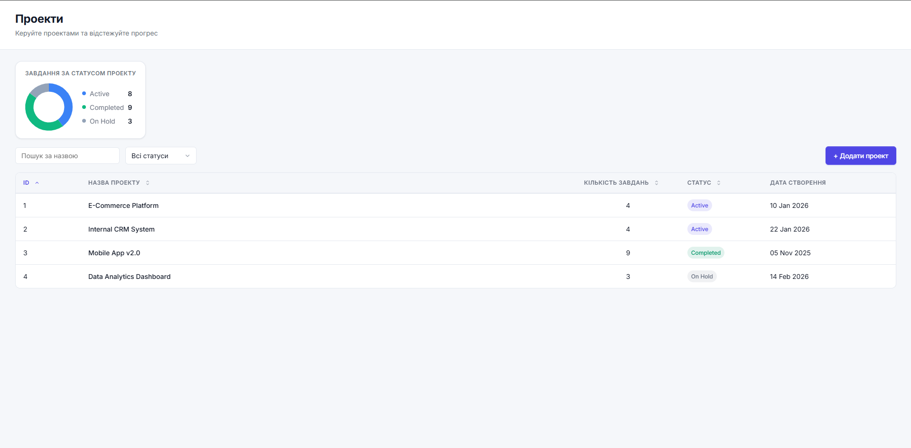
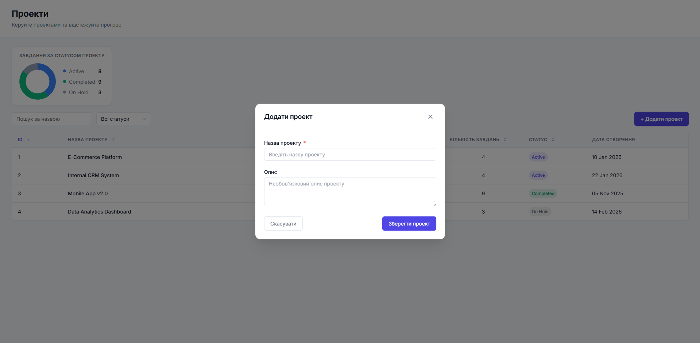
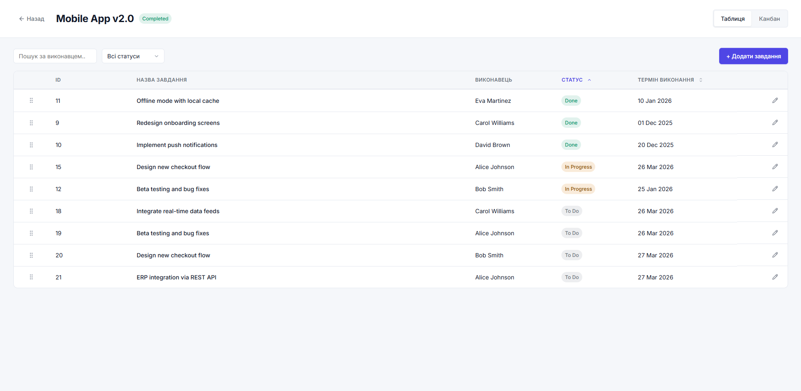
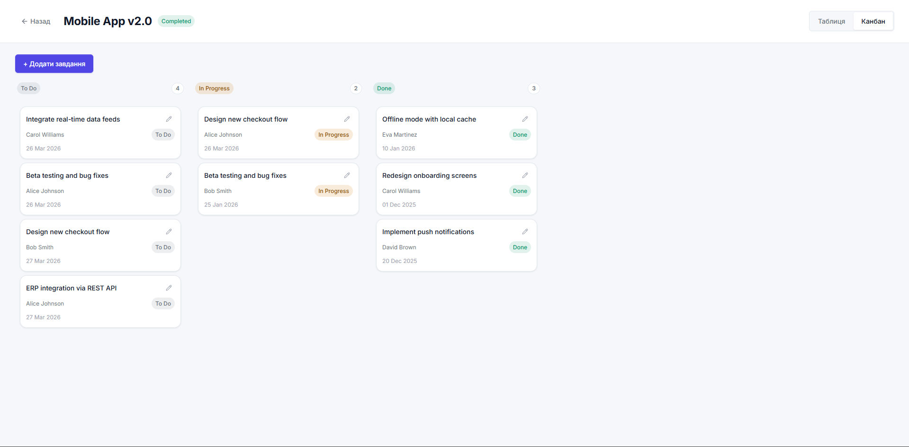
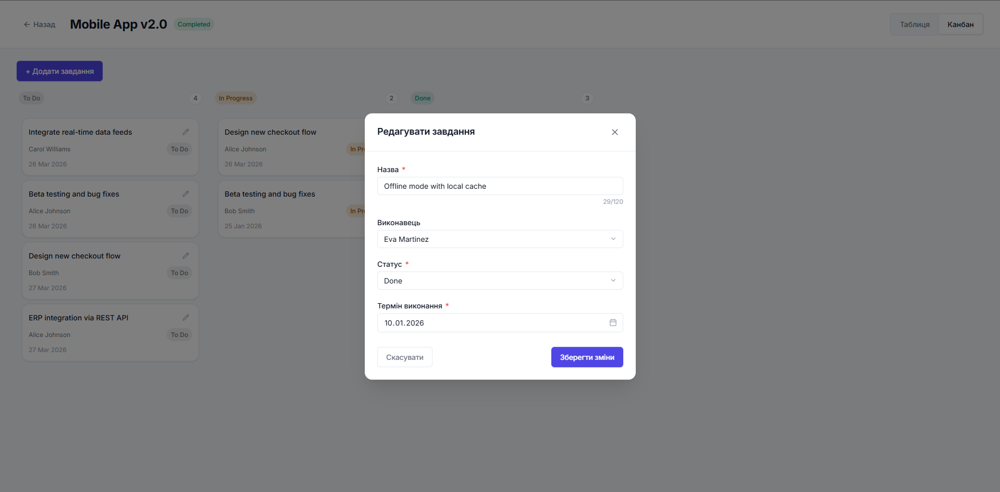

# Project Management SPA

A project and task management single-page application built with Vue 3.

**Live demo:** https://project-management-spa.vercel.app/

---

## Screenshots

### Projects




### Tasks





---

## Tech Stack

- **Vue 3** + TypeScript + Composition API
- **Pinia** — state management with localStorage persistence
- **Vue Router** — client-side routing
- **Axios** — HTTP client
- **Vite** — build tool
- **Chart.js** / **vue-chartjs** — task statistics chart
- **vue-draggable-plus** — drag-and-drop for Kanban board
- **SCSS** — styling

---

## Features

- Projects list with filtering, sorting, and resizable columns
- Task management per project: table view and Kanban board
- Drag-and-drop task reordering
- Task statistics chart by project status
- Persistent UI state (column widths, view mode, filters)

---

## Local Setup

### Prerequisites

- Node.js 18+
- npm

### Install

```bash
npm install
```

### Run (frontend + API server together)

```bash
npm run dev:all
```

This starts:
- **json-server** on `http://localhost:3000` — mock REST API
- **Vite dev server** on `http://localhost:5173` — Vue app

### Run separately

```bash
# Terminal 1 — API server
npm run server

# Terminal 2 — Vue app
npm run dev
```

---

## Deployment

The app is deployed as two parts on **Vercel**:

### Frontend
Static build served by Vercel CDN. Auto-deploys on every push to `main`.

### Backend (mock API)
A Vercel Serverless Function (`api/[...path].ts`) acts as a REST API server — a replacement for json-server in production. It reads initial data from `db.json` into memory and handles all CRUD operations (`GET`, `POST`, `PUT`, `PATCH`, `DELETE`) for `/api/projects` and `/api/tasks`.

> **Note:** The serverless function uses in-memory storage. Data persists while the function instance is warm (typically several minutes of idle time). On cold start, data resets to the initial `db.json` state.

### Environment variables

| Variable | Development | Production |
|---|---|---|
| `VITE_API_URL` | `http://localhost:3000` | `/api` |

### Deploy your own

1. Fork the repository
2. Connect the repo to [Vercel](https://vercel.com)
3. Vercel will auto-detect the Vite framework and deploy
4. No additional configuration required — `vercel.json` is included
